# Belgian COVID apps analysis

- [Belgian COVID apps analysis](#belgian-covid-apps-analysis)
  - [Permission checking](#permission-checking)
    - [CovidSafe permissions](#covidsafe-permissions)
    - [CovidScan permissions](#covidscan-permissions)
    - [Coronalert permissions](#coronalert-permissions)
  - [Framework](#framework)
    - [CovidSafe framework detection](#covidsafe-framework-detection)
    - [CovidScan  framework detection](#covidscan--framework-detection)
    - [Coronalert  framework detection](#coronalert--framework-detection)
  - [Intercepting traffic](#intercepting-traffic)
    - [Disable SSL pinning on flutter](#disable-ssl-pinning-on-flutter)
    - [Ghidra reverse engineering of libflutter.so](#ghidra-reverse-engineering-of-libflutterso)
      - [Looking for Scalar](#looking-for-scalar)
        - [From library in Ghidra](#from-library-in-ghidra)
        - [Comparisaon of the offset of older flutterlib.so from nviso blog](#comparisaon-of-the-offset-of-older-flutterlibso-from-nviso-blog)
      - [Checking offset with binwalk](#checking-offset-with-binwalk)
      - [Test the script](#test-the-script)

Custom tool used: https://github.com/righettod/powershell-android-utils

## Permission checking

### CovidSafe permissions

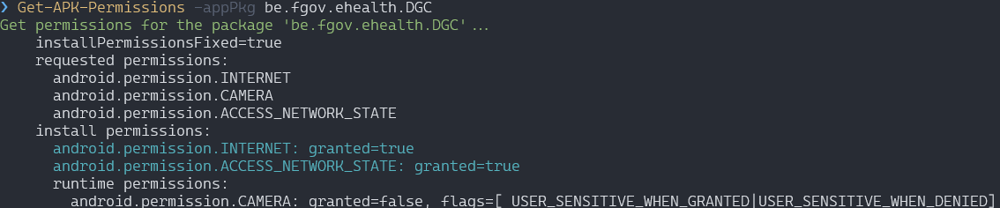

### CovidScan permissions

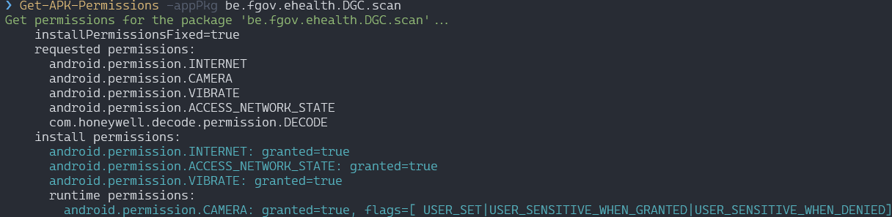

### Coronalert permissions

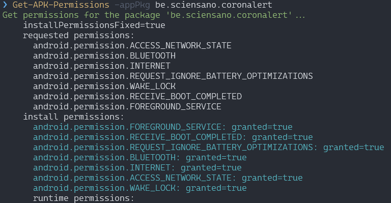

## Framework

### CovidSafe framework detection

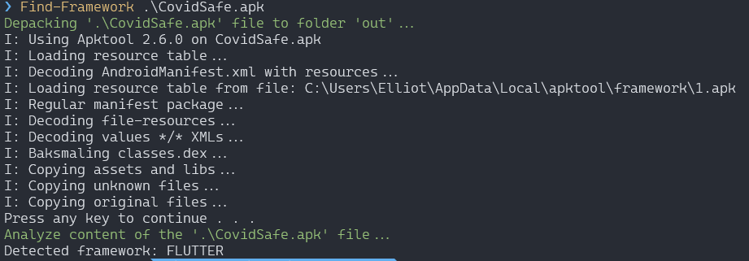

Flutter framework

### CovidScan  framework detection

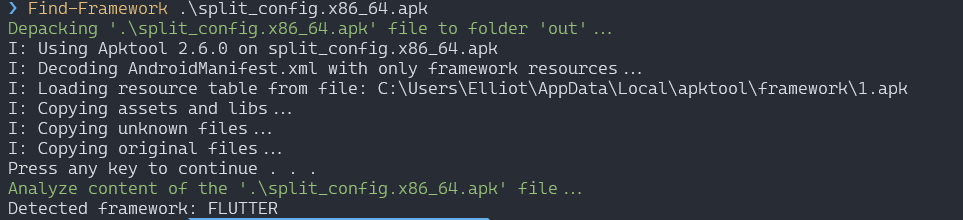

Flutter framework

### Coronalert  framework detection

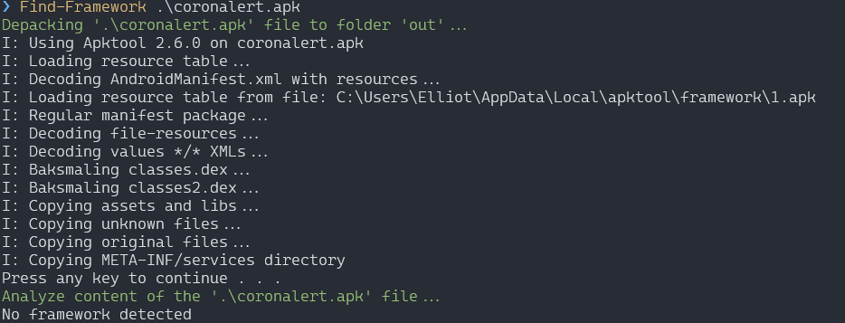

No framework (native)

## Intercepting traffic

### Disable SSL pinning on flutter

### Ghidra reverse engineering of libflutter.so

Reference: https://blog.nviso.eu/2020/05/20/intercepting-flutter-traffic-on-android-x64/

Analysing libflutter.so using Ghidra

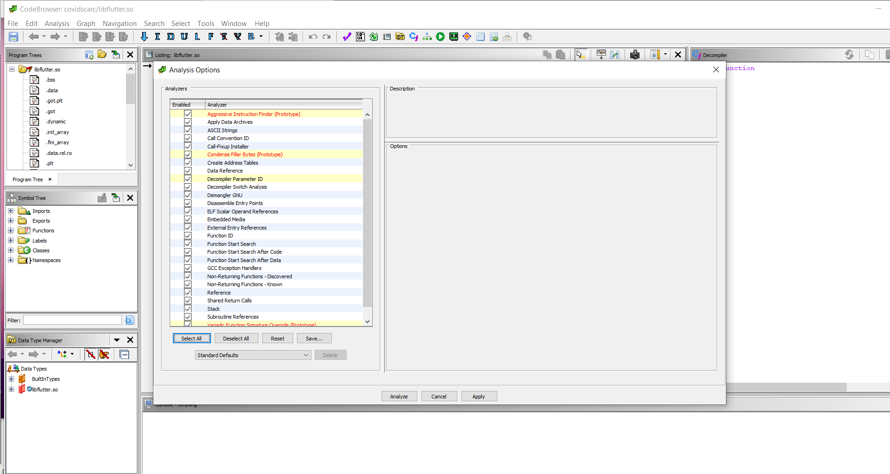

Looking for x509.cc

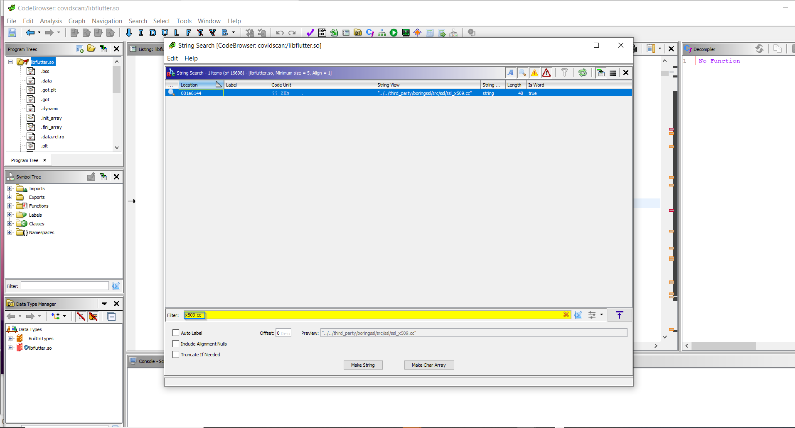

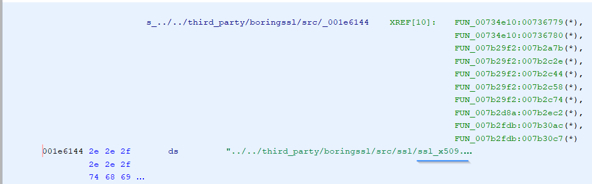

Then I realized I was doing on x86_64 due to my emulator instead of ARM

Because there are slight differences in the flutter library depending on architectures I started over with an ARM64 APK of the application.

ARM64 flutterlib.so

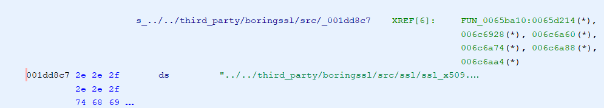

#### Looking for Scalar

The author of the Nviso blog post suggest to look for scalar of the OPENSSL_PUT_ERROR macro in function ssl_crypto_x509_session_verify_cert_chain to find the function.

In the last commit of x509.cc from boringssl, it was one line 399  ==> 0x18F, however no possible match were found.

Other possibles values from [x509cc Github history](https://github.com/google/boringssl/commits/master/ssl/ssl_x509.cc)  
390 ==> 0x186 (2017 - June 2021)  ❓  
398 ==> **0x18e** (June 2021 - August 2021) ✔  
399 ==> 0x18f ( August 2021 - now)  ❓  

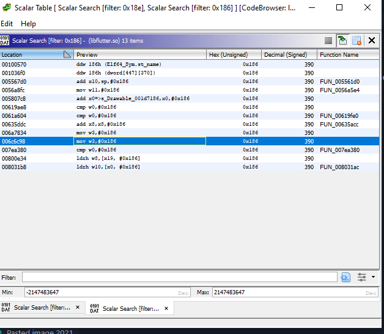

function candidate(s) that have a matching signature:

void FUN_006c6b7c(long param_1,undefined8 param_2,undefined *param_3)

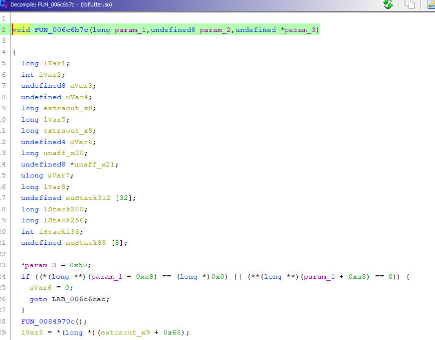

base address of the module to substract: 00100000

offset = 0x5c6b7c  

first bytes of the FUN_006c6b7c function:

##### From library in Ghidra

`ff 03 05 d1 fd 7b 0f a9 fa 67 10 a9 f8 5f 11 a9 f6 57 12 a9 f4 4f 13 a9 08 0a 80 52`

##### Comparisaon of the offset of older flutterlib.so from nviso blog

`ff 03 05 d1 fc 6b 0f a9 f9 63 10 a9 f7 5b 11 a9 f5 53 12 a9 f3 7b 13 a9 08 0a 80 52`

#### Checking offset with binwalk

```bash
binwalk -R "\xff\x03\x05\xd1\xfd\x7b\x0f\xa9\xfa\x67\x10\xa9\xf8\x5f\x11\xa9\xf6\x57\x12\xa9\xf4\x4f\x13\xa9\x08\x0a\x80\x52"
```

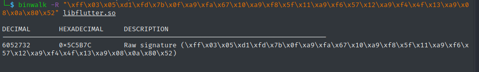

#### Test the script

flutter frida -Uf be.fgov.ehealth.DGC.scan -l hook_ssl_flutter.js --no-pause
