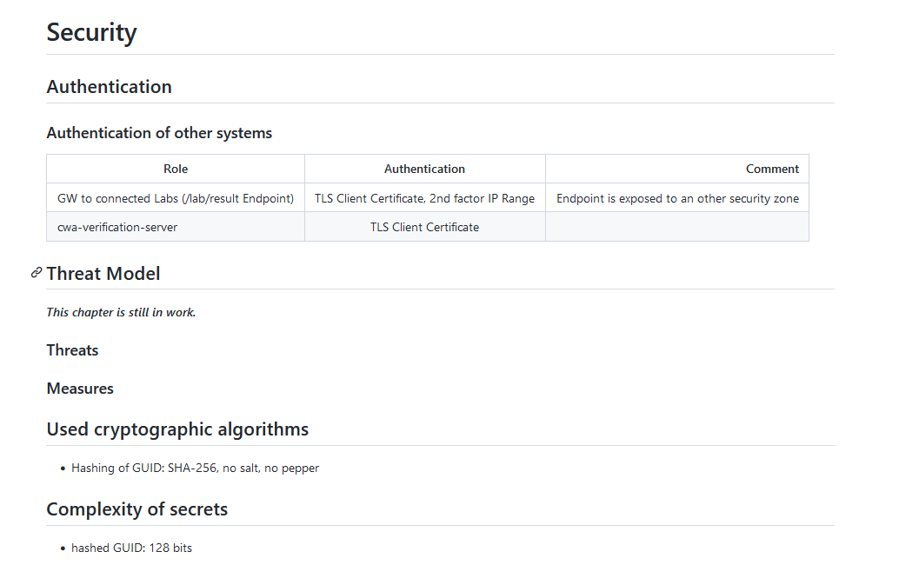

# BE Covid application research

- [BE Covid application research](#be-covid-application-research)
  - [Coronalert](#coronalert)
    - [Software design](#software-design)
    - [Back end infrastructure](#back-end-infrastructure)
    - [infectiousness and alert triggering](#infectiousness-and-alert-triggering)
    - [security](#security)
    - [use cases](#use-cases)
  - [CovidSafe](#covidsafe)
  - [CovidScan](#covidscan)
  - [European certificates sharing](#european-certificates-sharing)

## Coronalert

The belgian Coronalert application is a copy of the german application Corona Warn App (CWA).
Developped originally by SAP (DE) and overseen by cyber security experts from german research institutes.

The App sends a push message to users if they have been exposed to a person diagnosed  with COVID-19 (at  least 15 minutes  within the  last 14 days).

⚠ Some laboratories and public health offices aren't equipped with the digital infrastructure to send test results to the system.
People who have been tested by such laboratories won't be reported in Coronalert.

Method:
Pseudonymised data and Bluetooth technology.

- NO GEOLOCATION  
- NO CONTACT ACCESS

Spring Boot, PostgreSQL for the back-end and API

Open Source: https://github.com/covid-be-app
TLS 1.3
Certificate pining : Yes
Root and/or emulator detection : No

### Software design

### Back end infrastructure

### infectiousness and alert triggering

### security

https://github.com/corona-warn-app/cwa-documentation/blob/master/overview-security.md

### use cases

## CovidSafe

Technologies: Flutter and Dart
TLS 1.2
Certificate pining : Yes
Root and/or emulator detection : No

## CovidScan

Technologies: Flutter and Dart
Flutter framework (dart -- pseudo JavaSript)
ByPass SSLPinning on flutter is difficult
Pinning in compiled librairies.

TLS 1.2
Certificate pining : Yes
Root and/or emulator detection : No

## European certificates sharing

https://github.com/eu-digital-green-certificates/

https://ec.europa.eu/health/sites/default/files/ehealth/docs/digital-green-certificates_v2_en.pdf

